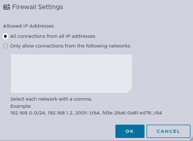

#### Manipulation via l'interface graphique

*Services*

Menu `Host` > `Manage` > `services`
Modifiez la `Policy` comme sur l'exemple présenté et choisissez l'option `Start an stop manually` afin d'éviter que le service ne soit actif au démarrage du serveur.

Arrêtez le service

Selectionnez la `Policy`

Appliquer/Vérifiez les mêmes paramètres pour le service slpd


*Règles de pare-feu*

Menu `Networking` > `Firewall rules`
choisissez `Edit settings`:


Éditez la règle pour n'ajouter que la ou les adresses IP, ou encore réseau(x), à pouvoir se connecter à votre système ESXi.
exemple avec une adresse privée:



#### Manipulation via le shell

*Services*
Désactivez les services inutiles:

Service SLP
```bash
/etc/init.d/slpd stop
esxcli network firewall ruleset set -r CIMSLP -e 0
chkconfig slpd off
```

Service SSH
```bash
/etc/init.d/SSH stop
esxcli network firewall ruleset set -r sshServer -e 0
chkconfig SSH off
```

Vérifiez l'ensemble des services actifs au démarrage:
```bash
chkconfig --list|grep on
```


*Règles de pare-feu*
Afficher les règles de pare-feu existantes:
```bash
esxcli network firewall ruleset list
esxcli system account list
```

exemple de modification/ajustement de régle d'accès avec le service `vSphereClient`:
```bash
esxcli network firewall ruleset list --ruleset-id vSphereClient
```
Assurez vous que le service soit actif:
```bash
esxcli network firewall ruleset set --ruleset-id vSphereClient --enabled true
```
Obtenez le statut du tag `allowedAll` pour le service:
```bash
esxcli network firewall ruleset allowedip list --ruleset-id vSphereClient
```
Changer le statut du tag en le désactivant:
```bash
esxcli network firewall ruleset set --ruleset-id vSphereClient --allowed-all false
```
Ajouter l'adresse préivée légitime 192.168.1.10:
```bash
esxcli network firewall ruleset allowedip add --ruleset-id vSphereClient --ip-address 192.168.1.10
```
Vérifier l'adresse dans la liste d'accès:
```bash
esxcli network firewall ruleset allowedip list --ruleset-id vSphereClient
```

recharger la configuration avec la nouvelle régle:
```bash
esxcli network firewall refresh
```

## Aller plus loin
Échangez avec notre communauté d'utilisateurs sur <https://community.ovh.com/>.
